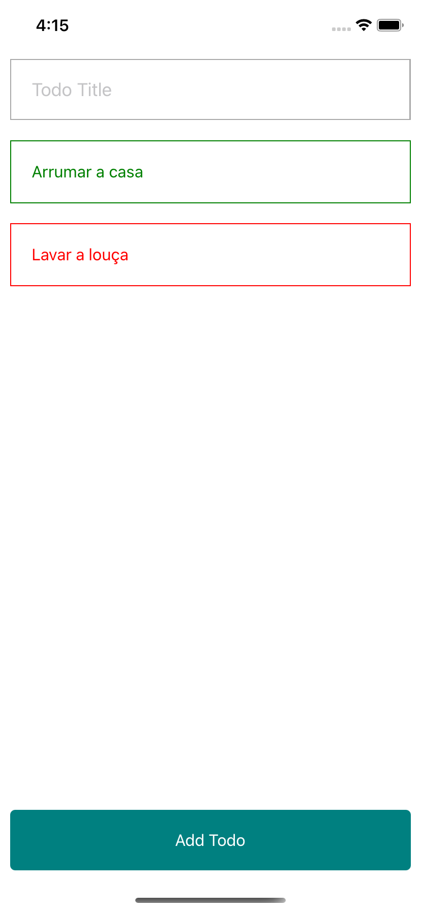

# App todo com react native

Um app bem simples feito em react native, que adiciona todos e remove todos

## Tutorial

1. Faça o setup do seu ambiente para rodar o react-native https://reactnative.dev/docs/environment-setup
2. Instale as dependencias usando `yarn` ou `npm install` (Caso esteja no macOS rode apos o install `yarn pod:install` ou `npm run`)
3. Rode em uma nova instancia do terminal `yarn start`
4. Rode `yarn ios` para rodar no ios (Precisa estar no mac os) e `yarn android` para rodar no android

## Screenshot

